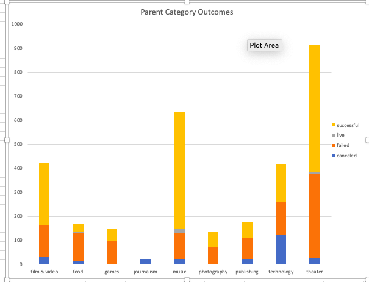
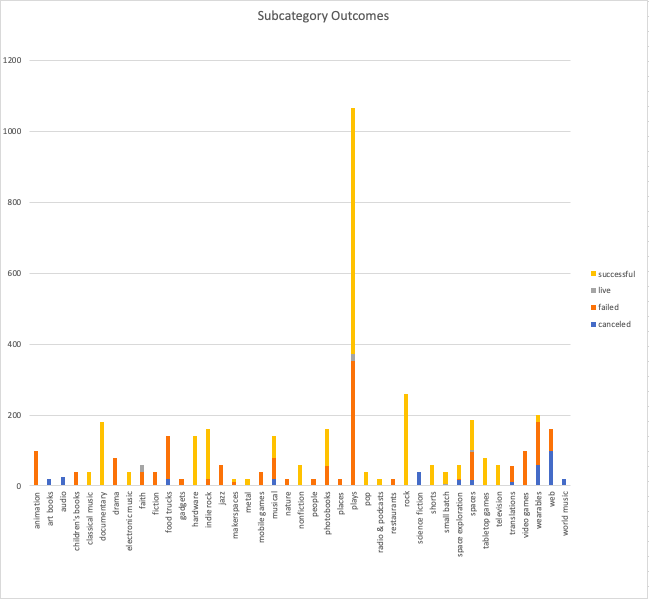
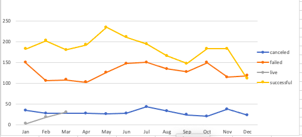
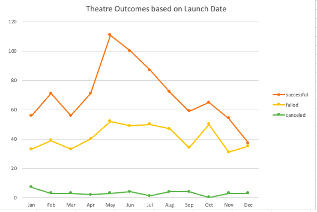
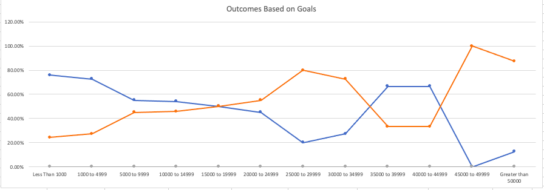

# Kickstarter

## Overview of Project:

This report will look at more than 4000 kickstarter crowdfunding campaigns from different countries. The data analyzed includes the name, blurb, funding goal, amount of money pledged, outcome, country, currency, deadline, date launched, number of backers, category, and subcategory. The goal of the analysis is to help Louise compare similar campaigns to better approach hers. We will evaluate how the funding goal and different launch dates affected the outcome of theater/plays campaigns.

## Analysis and Challenges:

### Analysis:
  
When first analyzing the dataset; we organized it by adding filters to concentrate on:

*	what were the goals set 
*	how much was pledged on each goal
*	 the outcomes of these campaigns 
*	what countries they took place in

The first step taken into finding a trend was to analyze the outcomes of the parent categories in the dataset.

In doing so we found that "Theatre" had the greatest rate of success compared to the other categories.

When analyzing the subcategories, plays had significantly the most success in comparison to the other subcategories.
 
Then we looked into what would be the best time to launch the Kickstarter campaign.

 
Based on our “Launch Date Outcomes,” we concluded that May experienced the successful Kickstarter campaign launches and January, June, July, and October experienced the most failures.

Eventually, our “Descriptive Statistics” revealed that US Kickstarter campaigns for plays have failed due to having fundraising goals that are too high, especially in comparison to campaigns that have succeeded.

We also have to acknowledge that Louise is asking for more than twice the average of successful campaign goals, which statistically means she will most likely fail.

### Challenges: 
The main challenge that I encountered was organizing the “Outcomes Based on Goals” correctly. I struggled to nest the “COUNTIF” formula correctly, I originally assumed that if I had the dataset already filtered I would get the accurate number of outcomes. However, after some trial and error, I learned to correctly nest the formula and receive the accurate numbers.

## Results
 
The conclusions that can be made about theatre outcomes based on launch date are:

1.	May and June would be the best months to launch the campaign
2.	January, March, September, and December would be the worst months to launch

 
The conclusions that can be made on outcomes based on Goals are:

1.	When campaign goals are set too high, especially above $25,000, there is a far greater chance of the campaign failing. Campaigns between $10,000-$14,999 and less had greater success rates.

### Summary:

* A more up-to-date dataset in regards to years would have been more helpful. If we had a dataset that had projects finished at least in 2019, Louise would be able to mirror her campaign based on more current examples.

*	More data about ongoing funding could have also been helpful to Louise, especially if she wants her play to last beyond a successful launch. Therefore, more information on how long other productions lasted and how much needed to be pledged to maintain the production. I would have also have included a graph to show the average of how long shows would last after their successful launch.

